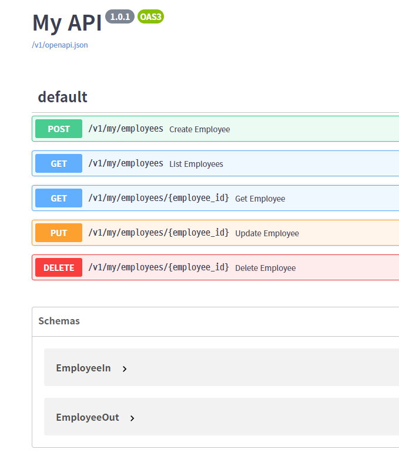

# Django Ninja API

Django Ninja API boilerplate 만들기, 사용자 앱을 만들어서 API를 제공하면 된다.
사용자 기능만 집중해서 할 수 있도록, 최초 장고 Ninja API 의 기본 틀을 잡아주는 프로젝트입니다. 프로젝트 fork해서 시작하시면 됩니다.

## 다운로드

zip파일을 다운로드 하던지, fork해서 사용하자

## 파이썬 가상 개발 환경 만들기

다운로드 작업이 완료되면, 파이썬 가상 환경을 만든다.

```bash
python -m venv venv
```

수행하면 로컬 폴더에 venv 폴더가 생성된다. 단, 이 폴더는 git에 업로드 되지 않는다.  
이미 .gitignore 에 등록 되어 있다.
그럼 만든 가상환경을 activate 해야 한다.

```bash
$ source venv/Scripts/activate
(venv) 
```

참고로 deactivate 시키는 방법은 그냥 `deactivate` 이렇게 타이핑하면 된다.

```bash
$ deactivate
```


## 라이브러리 설치하기

pip 명령을 이용하여 Djagno ninja 를 설치하도록 한다.

```bash
$ pip install django-ninja
Collecting django-ninja
  Using cached django_ninja-0.22.2-py3-none-any.whl (2.3 MB)
Collecting Django>=2.2
  Using cached Django-4.2.4-py3-none-any.whl (8.0 MB)
Collecting pydantic<2.0.0,>=1.6
  Using cached pydantic-1.10.12-cp38-cp38-win_amd64.whl (2.2 MB)
...
Installing collected packages: typing-extensions, tzdata, sqlparse, backports.zoneinfo, asgiref, pydantic, Django, django-ninja
Successfully installed Django-4.2.4 asgiref-3.7.2 backports.zoneinfo-0.2.1 django-ninja-0.22.2 pydantic-1.10.12 sqlparse-0.4.4 typing-extensions-4.7.1 tzdata-2023.3
WARNING: You are using pip version 21.1.1; however, version 23.2.1 is available.
You should consider upgrading via the 'c:\users\user1\documents\work\djangoninjaapi_boilerplate_bjnhur\venv\scripts\python.exe -m pip install --upgrade pip' command.
(venv) 
```

## 장고프로젝트 생성

```bash
$ django-admin startproject myproject
(venv) 
$ cd myproject/
(venv) 
```

## 실행하기

### DB 변경시 반드시 수행

데이터 베이스가 변경되면 아래 과정은 반드시 수행해야 한다.  
db migrate 실행

```bash
$ python manage.py makemigrations && python manage.py migrate
No changes detected
Operations to perform:
  Apply all migrations: admin, auth, contenttypes, sessions
Running migrations:
  Applying contenttypes.0001_initial... OK
  Applying auth.0001_initial... OK
  Applying admin.0001_initial... OK
  Applying admin.0002_logentry_remove_auto_add... OK
...
  Applying auth.0012_alter_user_first_name_max_length... OK
  Applying sessions.0001_initial... OK
(venv) 
```

### 최초 실행시 한번 수행하는 과정

슈퍼유저를 하나 만들어 둬야 admin 페이지 접근이 가능하다.  
예제로 admin / abcd1234!로 일단 생성한다.

```bash
$ python manage.py createsuperuser
Username (leave blank to use 'user1'): admin
Email address: admin@a.com
Password: 
Password (again):
Superuser created successfully.
(venv) 
```


### API 서버 실행하기

아래와 같이 명령을 주면 실행해서 테스트가 가능하다. 포트넘버를 바꾸고 싶다면 8000 숫자를 변경하면 된다.

```bash
$ python manage.py runserver 0.0.0.0:8000
Watching for file changes with StatReloader
Performing system checks...

System check identified no issues (0 silenced).
August 22, 2023 - 11:13:08
Django version 4.2.4, using settings 'myproject.settings'
Starting development server at http://0.0.0.0:8000/
Quit the server with CTRL-BREAK.

```

장고 프로젝트 템플릿 홈페이지가 나타난다. 제대로 따라왔으면,  
/admin 페이지도 정상적으로 나타나고, admin 로그인도 가능하다.  

## 앱 추가하기

앱을 추가해서 API 목록을 제공하자.  
아래 명령으로 앱을 만들고,  

```bash
$ python manage.py startapp myapi
```

myproject/settings.py 파일 내에 앱이름을 추가해 줘야 한다.

```python
INSTALLED_APPS = [
    "django.contrib.admin",
    ...
    # Local app
    "myapi",
]
```

1. model 추가

이미 생성되어 있는 `models.py` 파일에 원하는 모델을 추가한다.

1. Schema 추가
schemas.py 파일을 추가한다.  
예제를 참고해서 내용을 넣는다.  

## URL API 추가

in myproject/urls.py 파일 내에 아래와 같이 전체 NinjaAPI를 추가하고, 앱 주소를 router 기능을 이용하여 추가한다.

```python

from ninja import NinjaAPI
from myapi.api import api as myapi_router

# from myapi.api_v2 import router as myapi_router_v2

# urls_namespace doc:
# https://django-ninja.rest-framework.com/guides/versioning/
# Routers doc:
# https://django-ninja.rest-framework.com/guides/routers/
api = NinjaAPI(urls_namespace="bbbapi", version="1.0.1", title="My API")
api.add_router("my", myapi_router)
# api_v2 = NinjaAPI(urls_namespace="bbbapi_v2", version="2.0.1", title="My API")
# api_v2.add_router("my", myapi_router_v2)

urlpatterns = [
    path("admin/", admin.site.urls),
    # API urls
    path("v1/", api.urls),
    # path("v2/", api_v2.urls),
]

```

## 실행하기

DB migration

```bash
$ python manage.py makemigrations && python manage.py migrate
Migrations for 'myapi':
  myapi\migrations\0001_initial.py
    - Create model Department
    - Create model Employee
Operations to perform:
  Apply all migrations: admin, auth, contenttypes, myapi, sessions
Running migrations:
  Applying myapi.0001_initial... OK
(venv) 

```

장고 실행

```bash
$ python manage.py runserver 0.0.0.0:8000
Watching for file changes with StatReloader
Performing system checks...
```

## 브라우저 확인

### API openapi 문서 확인

<http://localhost:8000/v1/docs>

